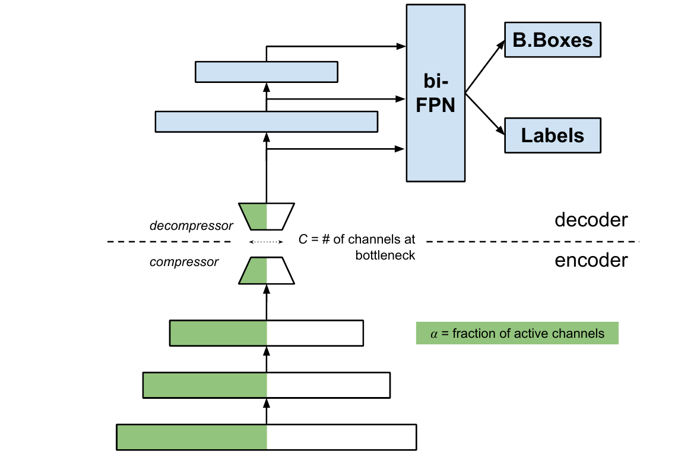

# Collaborative Object Detectors Adaptive to Bandwidth and Computation

**!News: This paper has been accepted to ICASSP 2022**

The final version will be uploaded soon, until then check our preprint @ https://arxiv.org/abs/2105.00591. 
If you want to cite us please use the bibtex bellow:

```
@article{assine2021single,
  title={Collaborative Object Detectors Adaptive to Bandwidth and Computation},
  author={Assine, Juliano S and Santos Filho, JCS and Valle, Eduardo},
  booktitle={ICASSP 2022-2022 IEEE Int. Conf. on Acoustics, Speech and Signal Processing (ICASSP)},
  pages={4467--4471},
  year={2022},
  organization={IEEE}
}

```

Also, this repo is based on [yoshitomo-matsubara/hnd-ghnd-object-detectors](https://github.com/yoshitomo-matsubara/hnd-ghnd-object-detectors). Go check out their work.

## Summary
In this work we explore split object detectors such as the one bellow


# Repository setup

## How to clone
```
git clone https://github.com/jsiloto/adaptive-cod
cd adaptive-cod
git submodule init
git submodule update --recursive --remote
```

## COCO 2017 Dataset
Make sure you have the COCO2017 dataset downloaded
```
mkdir -p ./resource/dataset/coco2017
cd ./resource/dataset/coco2017
wget http://images.cocodataset.org/zips/train2017.zip
wget http://images.cocodataset.org/zips/val2017.zip
wget http://images.cocodataset.org/annotations/annotations_trainval2017.zip
unzip -q train2017.zip
unzip -q val2017.zip
unzip -q annotations_trainval2017.zip
```


## Docker environment
We highly recommend using the provided Dockerfile for setting up your environment.
```
docker build -f Dockerfile -t adaptive_cod .

docker run --gpus all --rm -it \
 -p 8888:8888 -v $PWD:/work --shm-size=16G \
 -w /work adaptive_cod /bin/bash
```

## Checkpoints with trained model weights
We recommend running ```python download_weights.py``` to avoid manually configuring the paths

- Official weights for this repo can be found [here](https://drive.google.com/file/d/1qdClbGL5KwgEc4oG023DJckQiidNHDF2/view?usp=sharing).
They should reside under ```./resource/ckpt/acod```
- Weights from Matsubara et al. can be found [here](https://drive.google.com/file/d/1K7MNVuW99uDMHciewVS71hks_YdU9_2A/view?usp=sharing).
They should reside under ```./resource/ckpt/ghnd```
- Pretrained weights for Faster/Mask-RCNN are provided by pytorch
- Pretrained weights for EfficientDet Models can be found [here](https://github.com/zylo117/Yet-Another-EfficientDet-Pytorch/)

# Running
Each configuration file at ```./config``` can be used in 3 different ways: train/eval/analyze.
If a checkpoint is found at ```./resource/ckpt``` it will be loaded for use. 

Obs.: Checkpoint and config file names may be different. They are bound together by config variables.
## Examples
### Train
```
python src/mimic_runner.py --config $CONFIG_FILE_PATH -distill
```
### Eval
```
python src/mimic_runner.py --config $CONFIG_FILE_PATH
python src/eval_dir.py --dir ./config/acod
```
### Analyze
Provides statistics such as operation count, number of parameters and bandwidth requirements
```
python src/mimic_analyzer.py --config $CONFIG_FILE_PATH
python src/mimic_analyzer.py --dir ./config/acod/
```
